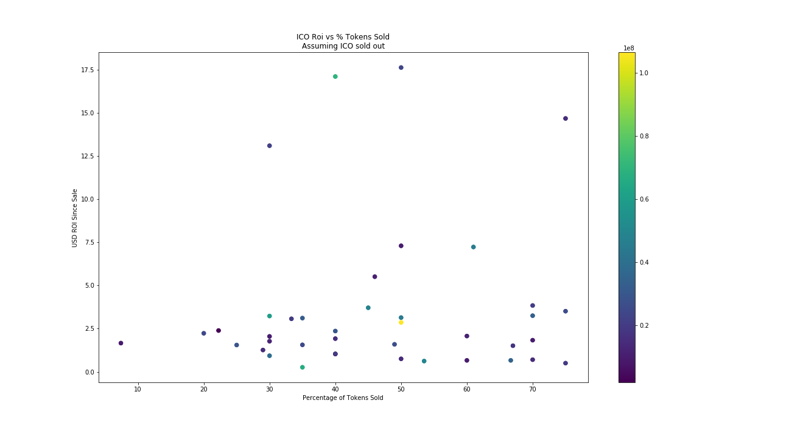

# ICO Sale Percentage Analysis

Is there relationship between the percentage of tokens sold and how well a token does post market? My assumptions are yes to some extent, but there are an infinite set of confounding variables that this analysis does not take into account.

Data: scrapped from [icodrops](https://icodrops.com)

## TLDR
No obvious correlation...
The assumption now is that if an ICO is oversubscribed it will do better post market, and it's easier to be over subscribed if an ICO finishes their cap.

